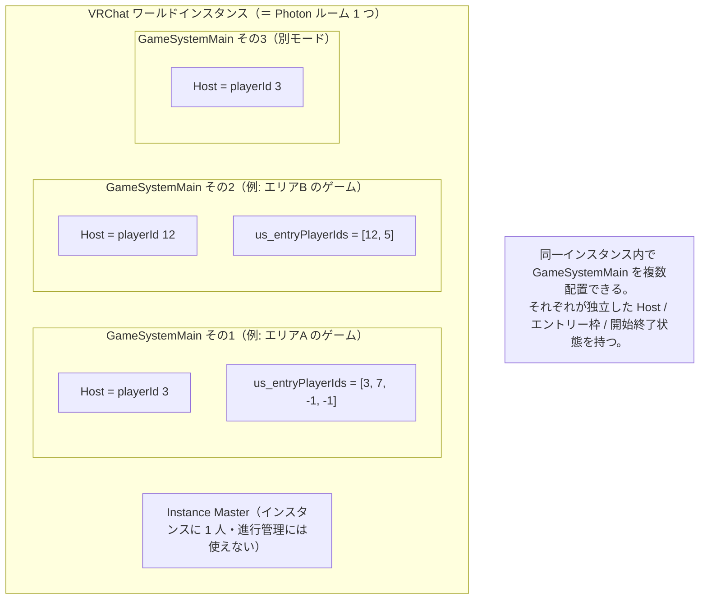
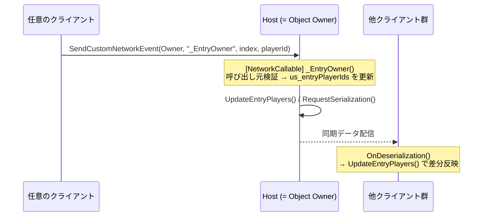
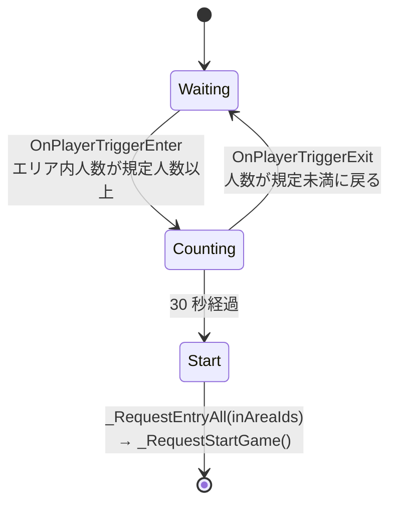

# VGC.GameFramework

VRChat ワールド（UdonSharp）向けの、**マルチプレイヤーのゲームセッション管理フレームワーク**。
「ホスト決定」「プレイヤーの参加枠（エントリー）管理」「ゲーム開始／終了状態」の共通処理を提供し、
ゲーム固有ロジックはコールバックインターフェース経由で差し込む。

asmdef: `VGC.GameFramework.Runtime`（`using`: `UdonSharp`, `VRC.SDKBase`, `VRC.SDK3.UdonNetworkCalling`, `TMPro`, `VGC.Attributes.Runtime`, `VGC.UIExtension.Runtime`）

---

## なぜ「ホスト」の仕組みが必要か

VRChat のネットワークは Photon 上に構築されているが、**ワールドインスタンス 1 つ = ルーム 1 つ**という扱いで、
インスタンス内にサブルームやロビーの概念がない。すべてのプレイヤーとオブジェクトが 1 つの共有ネットワーク空間に乗る。

VRChat が標準で提供する権限は次の 2 つで、どちらも「このゲームの進行を誰が仕切るか」には直接使えない。

| 標準の権限 | 粒度 | 性質 |
|---|---|---|
| Instance Master | インスタンスに 1 人 | 退出で自動移譲。インスタンス全体に 1 人しかいないので、**複数ゲームを個別管理できない** |
| Object Owner | GameObject ごと | あくまで「同期（シリアライズ）の書き込み役」。誰でも奪取でき、ゲーム進行の意思決定主体という意味を持たない |

そこで本フレームワークは、`GameSystemMain` 1 つごとに **Host（ホスト）** という論理的な進行権限を持たせる。
Host はそのゲームのフェーズ遷移・開始／終了判定・強制退出などを実行する責務を持つ playerId で、`us_hostPlayerId` に同期される。



### Host と Object Owner の関係

- **Host** … ゲーム進行の意思決定主体（フェーズ遷移、開始／終了、強制退出）。
- **Object Owner** … `RequestSerialization()` を実行してよいクライアント。
- フレームワークは **Host を Object Owner に一致させ続ける**（`OnChangeHost()` 内で `Networking.SetOwner`）。
  これにより「Host が同期書き込みも担当する」形に統一される。
- 各クライアントからの変更要求は `SendCustomNetworkEvent(NetworkEventTarget.Owner, …)` で Owner（＝Host）へ集約し、
  Host が synced 変数を更新して `RequestSerialization()`。他クライアントは `OnDeserialization` / `FieldChangeCallback` で反映。



### Host の選出と引き継ぎ

- `_autoHostSetup`（既定 true）: `Start()` 時に Owner なら自分を Host に設定。
- `_RequestSetHost()` → `_SetHostOwner(playerId)`（`us_hostPlayerId == -1` のときのみ受理）で明示的に取得も可能。
- Host が退出すると `OnOwnershipTransferred` → `_LeftPlayerCheck()` が発火し、
  `_autoHostSetup` 時はエントリー中プレイヤーの誰か、いなければ自分を新 Host に再割り当てして `RequestSerialization()`。

---

## 中核：`GameSystemMain`

`sealed partial class GameSystemMain : UdonSharpBehaviour`、`BehaviourSyncMode.Manual`。
4 ファイルに分割された partial クラス（`Runtime/GameSystem/`）。

### `GameSystemMain.cs` — ライフサイクル / 初期化 / ネットワーク入口の共通検証

- `Start()` … `_autoHostSetup` かつ Owner なら `US_HostPlayerId = LocalPlayer.playerId`。
- `InitializeIfNecessary()` … `us_entryPlayerIds` を `_gamePlayers.Length` 個・全要素 `-1` で確保（Owner のみ）。ローカルの差分比較用 `_prevEntryPlayerIds` も確保。
  非 Owner は同期データが未着（`us_entryPlayerIds == null`）なら初期化せずに return する。
  ここで `_initialized` を立ててしまうと、以降 null を参照して落ちる。
  同期された枠数が `_gamePlayers.Length` と食い違う場合もエラーログを出して初期化しない。
- `OnPlayerJoined` … ローカル & Owner のとき初期化。
- `OnDeserialization` … 初期化 → `UpdateEntryPlayers()`。
- `OnOwnershipTransferred` … 安全策として `_LeftPlayerCheck` を `SendCustomEventDelayedSeconds` で 0.5 秒後・15 秒後に遅延実行（新 Owner のタイミングずれを吸収するため 2 回）。
  - `_LeftPlayerCheck` は冪等（切断済みプレイヤーの掃除とホスト再割り当てのみ。何回呼んでも結果は同じ）なので、多重予約や重複実行は問題にならない。
  - ここは意図的に `VRCTween.DelayedCall` を使わない。`Kill` 手段があると「発火前にキャンセルされて安全チェックが遅延／消失する」ほうがリスク。確実に一定時間後へ届く `SendCustomEventDelayedSeconds` が適切。
- `OnPlayerLeft` … Owner のとき、退出者がエントリー中なら該当枠を `ExitPlayer`（退出者が Owner の場合は `OnOwnershipTransferred` 側に委譲）。
- `ValidateOwnerNetworkCall()` / `IsCallingPlayer()` / `IsCallingHost()` … `[NetworkCallable]` 入口の共通検証（後述）。

### `GameSystemMain.HostManager.cs` — ホスト管理

- `[UdonSynced, FieldChangeCallback(nameof(US_HostPlayerId))] int us_hostPlayerId = -1`。
  **初期値は必ず `-1`**。既定の `0` だと「ホスト未設定」の判定（`== -1`）が全て外れ、
  `_SetHostOwner` が常に失敗し、`OnChangeHost` が `0` を「誰かがホスト」とみなしてしまう。
- `_autoHostSetup`（既定 true）。
- `_RequestSetHost()` → `SendCustomNetworkEvent(Owner, _SetHostOwner)` → `[NetworkCallable] _SetHostOwner(playerId)`（未設定時のみ受理）。
- `OnChangeHost()` … 次の2段階で動く。
  1. **状態確定** … `_isHost` の更新と、ホストになった場合の `Networking.SetOwner`。
     コールバック件数に依存しないよう foreach の外で行う。
  2. **配信** … `_gameHostChangedCallbacks`（`IGameHostChanged` を実装した子）へ送出。
     Lost 系は「直前のホスト（`_prevHostPlayerId`）」、Became 系は「新しいホスト」を基準に
     Local / Remote を判定する。`prev == now` のときは何も送らない。

### `GameSystemMain.PlayerManager.cs` — エントリー枠管理

- `[UdonSynced] int[] us_entryPlayerIds` … 添字＝枠番号、値＝`playerId`、`-1` は空き。サイズは `_gamePlayers.Length`。
- 参照は Executor 属性で自動収集：
  - `_gamePlayers` = `AutoPopulateField(typeof(GamePlayerBase), Children)`
  - `_gamePlayerChangedCallbacks` = `AutoPopulateField(typeof(IGamePlayerChanged), Children)`
  - `_gameRule` = `AutoPopulateField(typeof(GameRule), Children)`
- 変更はすべて Owner 経由の `[NetworkCallable]`：

  | 要求 API（任意クライアント） | Owner 側の入口 | 内容 |
  |---|---|---|
  | `_RequestEntry(index)` | `_EntryOwner(index, playerId)` | ローカルを指定枠に参加させる。空き枠でなければ何もしない |
  | `_RequestExitLocalPlayer()` | `_ExitLocalPlayerOwner(playerId)` | ローカルを退出させる |
  | `_RequestEntryAll(int[] playerIds)` | `_EntryAllOwner(playerIds)` | 一括上書き。無効な Id は `-1` 扱い、重複は先勝ち |
  | `_RequestExit(playerId)` | `_ExitPlayerOwner(playerId)` | **ホストのみ**。指定プレイヤーを退出 |
  | `_RequestExitAll()` | `_ExitAllOwner()` | 全枠 `-1` |

  **トグル API（`_RequestToggleEntry`）は廃止した。** Owner に届いた時点の枠の状態で
  Entry / Exit が決まるため、「退出したい」1回が、その間に枠が空いていると参加に反転しうる。
  参加か退出かは呼び出し側で確定させる（`EntryPanelBase` は `LocalEntryIndex` を見て振り分ける）。

- `UpdateEntryPlayers()` … `_prevEntryPlayerIds` と現在値を差分比較し、
  - `GamePlayerBase._OnChangePlayer(playerId)` を呼ぶ
  - `_gamePlayerChangedCallbacks` へ引数（`{index, playerId}`）を `SetProgramVariable` で渡してから `_OnEntry` / `_OnExit` を送出
  - 全員退出したら `_OnExitAll` を送出し、**Owner のときだけ** `EndGame()`
    （このメソッドは `OnDeserialization` からも呼ばれる＝全クライアントで走るため、
    synced 変数を書く処理には Owner ガードが要る）
  - ローカルの参加枠 `_localEntryIndex` を追跡
- `_LeftPlayerCheck()` … Owner のとき、切断済み `playerId` を掃除。ホストが不在なら（`_autoHostSetup` 時）エントリー中の誰かへ再割り当て、いなければ自分。変更があれば `RequestSerialization`。
- 参照 API（`[PublicAPI]`。メソッドはネットワーク非公開なので先頭 `_`）:
  `LocalEntryIndex`, `EntryCapacity`（プロパティ）、
  `_GetEntryPlayerId(index)`, `_HasAnyEntry()`, `_IsEntry(playerId)`, `_IsEntryLocalPlayer()`, `_GetEntryIndex(playerId)`。
  内部配列は公開しない（外部から書き換えられるため）。

### ネットワーク入口の検証

`[NetworkCallable]` は誰でも任意の引数で呼べる。全ての Owner 側入口は先頭で
`GameSystemMain.cs` の共通ヘルパーを通す。

| ヘルパー | 内容 |
|---|---|
| `ValidateOwnerNetworkCall()` | `NetworkCalling.CallingPlayer` の妥当性 + `Networking.IsOwner`。転送中に Owner が移って非 Owner に届いたイベントを弾く |
| `IsCallingPlayer(playerId)` | 引数の `playerId` が呼び出し元本人か。ローカル呼び出し（`InNetworkCall == false`）は素通し |
| `IsCallingHost()` | ホスト限定操作の呼び出し元がホスト本人か |

加えて各入口で `index` の範囲と配列長を必ず検証する。範囲外アクセスは
`IndexOutOfRange` になり **Udon の実行が止まる**。
ネットワーク引数の `playerId` は呼び出し元が自由に詐称できるため、認可には使わない。

> `NetworkCalling.InNetworkCall` はネスト呼び出し中も true のままなので、
> ローカルからも呼ばれるメソッドはネットワーク入口と実処理を分ける
> （例: `[NetworkCallable] _EndGameOwner()` → `private EndGame()`）。

### 連打の間引き

`[NetworkCallable]` の既定レートは 5 回/秒で、**超過分は破棄されず送信側でキューされる**。
ボタン直結の入口をそのまま流すと、連打が遅れて順に適用される。
`_RequestEntry` / `_RequestExitLocalPlayer` / `_RequestStartGame` はローカルで 0.4 秒間引く。
タイマーは用途ごとに分ける（共有すると参加直後の退出や、`_RequestEndGame` →
`_OnGameEnd` → `_RequestExitAll` の内部チェーンが潰れる）。

### `GameSystemMain.StateManager.cs` — 開始／終了状態

- `[UdonSynced, FieldChangeCallback(nameof(US_IsGameStarted))] bool us_isGameStarted`。
- setter で `_gameStateChangedCallbacks`（`IGameStateChanged`）へ `_OnGameStart` / `_OnGameEnd` を送出。
- `_RequestStartGame()` / `_RequestEndGame()` → Owner 経由 `_StartGameOwner` / `_EndGameOwner`。
- `_StartGameOwner` … `_gameRule` があれば `_CanStartGame(this)` で可否判定、無ければ「1 人以上エントリー」で判定。

---

## 拡張ポイント

| 型 | 種別 | 使い方 |
|---|---|---|
| `GameRule`（`Runtime/Rules/GameRule.cs`） | abstract `UdonSharpBehaviour` | `_CanStartGame(GameSystemMain)` を override してゲーム開始条件を差し替え。既定は `_HasAnyEntry()` |
| `GamePlayerBase` | abstract `UdonSharpBehaviour`（Manual sync） | エントリー枠 1 つに対応。`_OnChangePlayer(playerId)` で `_player`（`VRCPlayerApi`）を解決。枠固有の状態はサブクラスで持たせる |
| `IGameHostChanged` | interface | `_OnLocalBecameHost`, `_OnRemoteBecameHost`, `_OnLocalLostHost`, `_OnRemoteLostHost`。子 `UdonSharpBehaviour` に実装すると自動収集される |
| `IGamePlayerChanged` | interface | `_OnEntry` / `_OnExit` / `_OnExitAll`。引数は `SetProgramVariable` で渡されるため、実装クラスは `GameSystemMain.EntryArgsVariableName` / `ExitArgsVariableName` と同名の `int[]` フィールド（既定 `_entryArgs` / `_exitArgs`）を宣言する。専用の基底クラスは用意しない（UdonSharpBehaviour は単一継承なので、基底を強制すると `GamePlayerBase` や独自基底と両立できなくなる） |
| `IGameStateChanged` | interface | `_OnGameStart` / `_OnGameEnd` |

---

## `UI/` — エントリー UI

- `EntryPanelBase`（`UdonSharpBehaviour`, Manual sync。`IGamePlayerChanged` / `IGameHostChanged` / `IGameStateChanged` を実装）
  - **これを継承してワールド固有のUIを作る想定**（`Base` はその意図）。abstract ではなく、そのままでも動く既定実装。
  - `_startButton` / `_entryButtons` を Executor 属性で自動収集。
  - `_OnEntryButtonClick(index)` → 自分が入っている枠なら `_RequestExitLocalPlayer()`、それ以外は `_RequestEntry(index)`。
  - `_OnStartButtonClick()` → `_gameSystemMain._RequestStartGame()`。
  - `UpdateButtons()` … ローカルの参加枠とゲーム開始状態でボタンの `Interactable` を制御。
  - `_hostPlayerText` / `_entryPlayerText`（`TextMeshProUGUI`）に表示更新。
- `EntryButton` / `StartButton` … `ButtonExtension`（`VGC.UIExtension`）を継承。`_OnClick()` で親 `EntryPanelBase` に通知。
  - `EntryButton.Index` = `AutoAssignIndexField(typeof(EntryPanelBase))` で連番割り当て。
  - `EntryPanelBase` 参照は `AutoPopulateField(..., NearestParent, Hierarchy, required:true)`。

---

## `Utility/`

### `TimeHelper`

サーバー時刻ベースのカウントダウン。

- `CalculateRemain(syncedStartTime, duration, out remainTime)` … `Networking.GetServerTimeInSeconds()` と `CalculateServerDeltaTime` で残り秒を算出（0 未満は 0）。
- `ShowCountDownTime(syncedStartTime, duration, TMP_Text, out remainTime, format, showZero)` … `TimeDisplayFormat` に応じて `TMP_Text` へ書き込み。
  - `Normal`（秒・切り上げ）/ `Sprite`（sprite 秒）/ `MinuteSecond`（`mm:ss`）/ `MinuteSecondSprite` / `WithMilliseconds`（`ss.mmm`）。

### `SpriteNumberFormatter`

`int` / `uint` を TMP の `<sprite index=N>` 連結文字列へ変換。マイナス記号 = `index 10`、コロン = `index 11`（`SpriteMinusIndex` / `SpriteColonIndex`）。`int.MinValue` も対応。

---

## ネットワークモデル

- `GameSystemMain` は **Manual sync**。状態変更はすべて `SendCustomNetworkEvent(NetworkEventTarget.Owner, …)` / `[NetworkCallable]` で **Owner に集約**し、Owner が synced 変数を書いて `RequestSerialization()`。
- 非 Owner は `OnDeserialization` / `FieldChangeCallback` 経由で反映。synced 変数に状態を持つため遅延参加者にも整合。
- **ホスト** ＝ ゲーム進行リクエストの権限主体、**オブジェクト Owner** ＝ シリアライズの権限主体。フレームワークはホストを Owner に保つように動く。

---

## 命名規約

詳細はユーザースキル `udon-code-conventions` を参照。

- `[UdonSynced]` フィールド … `us_` プレフィックス（`us_hostPlayerId` など）。公開プロパティは `US_`（`US_HostPlayerId`）。
- **`public` メソッドはすべて先頭 `_`**（`_RequestStartGame`, `_HasAnyEntry`, `_OnLocalBecameHost`, `_StartGameOwner` など）。
  レガシー `SendCustomNetworkEvent` の暗黙公開（`_` なし・引数なし public は属性なしでも呼べる）を構造的に発生させないため。
- **リモートから呼ばれるメソッド** … 上記に加えて `[NetworkCallable]` を付ける（`_SetHostOwner`, `_EntryOwner`, `_ExitLocalPlayerOwner`, `_StartGameOwner`, `_EndGameOwner` など）。
  ローカル / リモートの区別は `_` の有無ではなく **`[NetworkCallable]` の有無**で行う。
- **例外**: Unity / VRChat のマジックメソッド override（`Start`, `Update`, `OnDeserialization`, `OnPlayerJoined`, `OnOwnershipTransferred`, `OnPlayerLeft`, `OnPlayerRespawn` …）は engine 側のエントリポイントなのでリネームできず、`_` なしのまま残る。

---

## 使い方（概略）

1. ルートに `GameSystemMain` を配置。
2. 子にエントリー枠数だけ `GamePlayerBase` 派生を配置。
3. 子に `EntryPanelBase`（`EntryButton` 群 + `StartButton`）を配置。
4. ゲーム固有ロジックの `UdonSharpBehaviour`（`IGameHostChanged` / `IGamePlayerChanged` / `IGameStateChanged` 実装）を子に配置。
5. Attribute Executor を実行（メニュートグル ON、またはビルド時）して参照を自動配線。

実装例は [`Samples~/GameFrameworkSample`](Samples~/GameFrameworkSample/README.md) を参照（Package Manager の Samples から Import できる）。

---

## 別の使い方：`EntryPanelBase` を使わない自動エントリー

`EntryPanelBase` は「ボタン UI から `_RequestEntry` / `_RequestExitLocalPlayer` / `_RequestStartGame` を呼ぶ」ドライバの一実装にすぎない。
同じ公開 API（`GameSystemMain` の `[PublicAPI]` メソッド群）は任意の `UdonSharpBehaviour` から呼べるため、
UI を介さずトリガーエリアなどでエントリー・開始を駆動できる。

### 例：エリアに規定人数が入ったら 30 秒後に開始



実装の要点:

1. `OnPlayerTriggerEnter` / `OnPlayerTriggerExit` でエリア内プレイヤーを集計（コライダーは `Is Trigger`、プレイヤーレイヤーを拾う設定）。
2. 規定人数に達したら **`VRCTween.DelayedCall(this, nameof(_TryStart), 30f)`** で 30 秒タイマーを開始し、返り値の `VRCTweenHandle` を保持する。人数が規定未満に戻ったら `_timer.Kill()` でキャンセル。
3. `_TryStart()` で、エリア内 playerId 配列を枠数（`EntryCapacity`）に丸めて
   `_gameSystem._RequestEntryAll(playerIds)` → `_gameSystem._RequestStartGame()` を呼ぶ。

> **この用途では `SendCustomEventDelayedSeconds` を使わないこと。**
> キャンセル手段が無いため、Enter/Exit を繰り返すと予約が多重に積まれ、`_TryStart`（＝エントリー確定 + ゲーム開始）が意図せず複数回発火する。
> このように「途中でキャンセルしたい／冪等でない」遅延処理は、SDK 3.10.4 以降なら `VRCTween.DelayedCall` を使い、`VRCTweenHandle` を保持して `Kill()` する。再スケジュール時も「`Kill()` してから貼り直す」。
> 逆に、`_LeftPlayerCheck` のように **何回呼んでも安全で、確実に一定時間後に実行されてほしい**処理は `SendCustomEventDelayedSeconds` のままでよい（`Kill` されない保証のほうが重要）。

```csharp
using VRC.SDK3.Components;   // VRCTween / VRCTweenHandle

private VRCTweenHandle _startTimer;

// エリア内人数が規定人数に達したとき
private void _ScheduleStart()
{
    _startTimer.Kill();                                         // 既存タイマーを破棄（無効ハンドルは no-op）
    _startTimer = VRCTween.DelayedCall(this, nameof(_TryStart), 30f);
}

// 人数が規定未満に戻ったとき
private void _CancelStart()
{
    _startTimer.Kill();
}

public void _TryStart()
{
    // inAreaIds を EntryCapacity に丸めて（空きは -1）
    _gameSystem._RequestEntryAll(playerIds);
    _gameSystem._RequestStartGame();
}

void OnDestroy()
{
    _startTimer.Kill();
}
```

### 呼び出し側の権限メモ

| API | 必要な権限 | 備考 |
|---|---|---|
| `_RequestEntry` / `_RequestExitLocalPlayer` / `_RequestEntryAll` / `_RequestStartGame` / `_RequestEndGame` / `_RequestExitAll` | 不要（任意クライアント） | 内部で Owner へ転送され、Owner 側で処理される |
| `_RequestExit(playerId)` | `_isHost` のみ | ホスト以外が呼ぶとエラーログのみ |

- `OnPlayerTriggerEnter` はローカルでしか発火しない。全クライアントで同一のプレイヤー集合を得たい場合は、
  「1 クライアント（例: 現ホスト）でのみ集計して `_RequestEntryAll` する」か、判定自体を同期変数ベースにする。
- `_RequestEntryAll` は `playerIds.Length != EntryCapacity` だとエラーで弾かれるため、必ず枠数ぴったりに詰める（空き枠は `-1`）。
  長さの検証は要求側と Owner 側の両方で行う（リモートからは要求側のチェックを迂回できるため）。
- `_RequestExit(playerId)` は Owner へ転送され、Owner 側で「呼び出し元がホスト本人か」を検証する。
  同期呼び出しではないので、呼んだ直後に `_IsEntry()` を見てもまだ退出していない。
